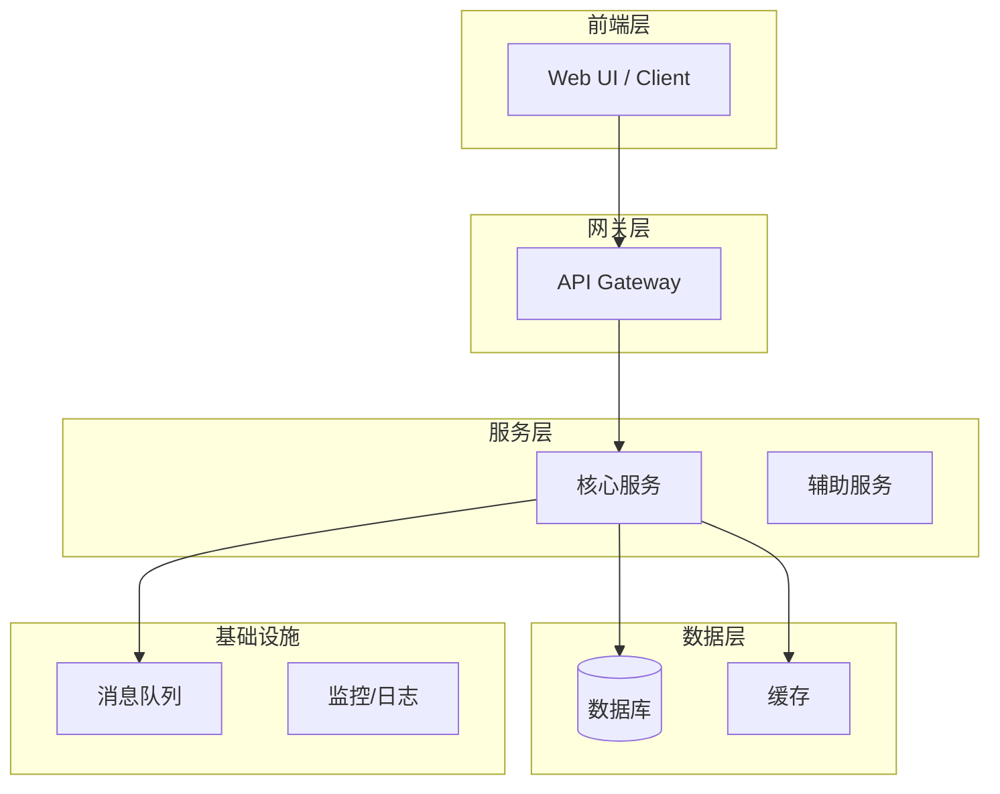

# proposal-{version}.md 模板

## 约束

proposal-generator 必须遵守：
- 严格基于 `research.md` 和用户方案选择，不得引入全新技术栈
- 每个模块必须量化指标
- 所有技术选型必须可追溯到 `research.md`

---

```markdown
# 技术方案报告 v{version} — {项目名称}

## 1. 项目背景

[200-300字：业务场景、核心目标、成功标准]

## 2. 核心挑战

[至少 3 个挑战，每个 50-100 字，说明为什么是挑战而非普通问题]

### 挑战 1: {标题}
{描述}

### 挑战 2: {标题}
{描述}

### 挑战 3: {标题}
{描述}

## 3. 技术架构设计

### 3.1 架构概述
[至少 500 字文字描述：整体架构思路、关键技术选型理由、数据流、控制流]

### 3.2 架构图



## 4. 模块设计

### 4.{N} 模块: {模块名称}

- **功能描述**: [200 字左右，说清楚模块职责和核心逻辑]
- **技术选型**: [从 research.md 选用的技术栈/框架，标注来源]
  - 语言/运行时: {如 Python 3.12 / Go 1.22 / Rust ...}
  - 核心框架: {如 FastAPI / Gin / Actix ...}
  - 第三方库: {如 LangChain / llama.cpp / OpenCV ...}
  - 选型依据: {引用 research.md 中该方案的优势分析}
- **输入**: {数据类型、格式、来源}
- **输出**: {数据类型、格式、去向}
- **输入输出示例**:
  ```
  输入: {"field": "value", ...}
  输出: {"result": "value", ...}
  ```
- **流程图**:
  ```mermaid
  flowchart LR
      A[输入] --> B{判断}
      B -->|条件1| C[处理A]
      B -->|条件2| D[处理B]
      C --> E[输出]
      D --> E
  ```
- **Corner Cases**:
  - [ ] 输入为空/null → {处理方式}
  - [ ] 输入超限 → {处理方式}
  - [ ] 依赖服务不可用 → {处理方式}
  - [ ] 并发冲突 → {处理方式}

[每个模块重复此结构]

## 5. 硬件选型

> 根据 requirements.md 中的性能/规模指标（Q2）和 research.md 中的技术方案，分析、预估或计算得出。不指定具体型号，仅给出规格参数。

### 5.1 服务器配置

| 硬件 | 最低配置 | 推荐配置 | 说明 |
|------|---------|---------|------|
| CPU | {X}核{Y}线程, 基频 ≥{Z}GHz | {X}核{Y}线程, 基频 ≥{Z}GHz | {选型理由，如：高主频适用于低延迟推理} |
| 内存 | {X}GB, DDR{Y}-{Z}MHz | {X}GB, DDR{Y}-{Z}MHz | {选型理由} |
| 系统盘 | {X}GB SSD | {X}GB NVMe SSD | |
| 数据盘 | {X}TB HDD/SSD | {X}TB NVMe SSD | {根据 Q3 数据量预估} |
| 网络 | 上行 ≥{X}Mbps, 下行 ≥{Y}Mbps | 上行 ≥{X}Mbps, 下行 ≥{Y}Mbps | {根据 Q2 吞吐量预估} |

### 5.2 GPU 配置（如需要）

| 硬件 | 最低配置 | 推荐配置 | 说明 |
|------|---------|---------|------|
| GPU 型号 | 显存 ≥{X}GB | 显存 ≥{X}GB | {选型理由，如模型参数量需求} |
| 显存 | ≥{X}GB | ≥{X}GB | {根据模型大小 + KV Cache + 并发估算} |
| 数据格式 | {FP16 / FP8 / FP4} | {FP16 / FP8 / FP4} | {精度需求分析} |
| 多卡互联 | {不需要 / NVLink / PCIe} | {不需要 / NVLink / PCIe} | {是否需张量并行/流水线并行} |

### 5.3 集群规模估算（如需要）

| 指标 | 值 | 计算依据 |
|------|-----|---------|
| 单节点吞吐 | {X} req/s | {计算方法} |
| 所需节点数 | {X} 台 | {并发/吞吐 × 冗余系数} |
| 总存储 | {X}TB | {数据量 × 副本数 × 增长系数} |

## 6. 人力与排期

| 序号 | 模块 | 前驱模块 | 后继模块 | 所需人力 | 预计工时(天) | 备注 |
|------|------|----------|----------|----------|-------------|------|
| 1 | {模块名} | - | 2,3 | {角色}×{人数} | {天数} | |
| 2 | {模块名} | 1 | 4 | {角色}×{人数} | {天数} | |

## 7. 风险与缓解

| 风险 | 概率(高/中/低) | 影响(高/中/低) | 缓解措施 |
|------|---------------|---------------|---------|
| {风险描述} | {概率} | {影响} | {具体缓解措施} |
```
